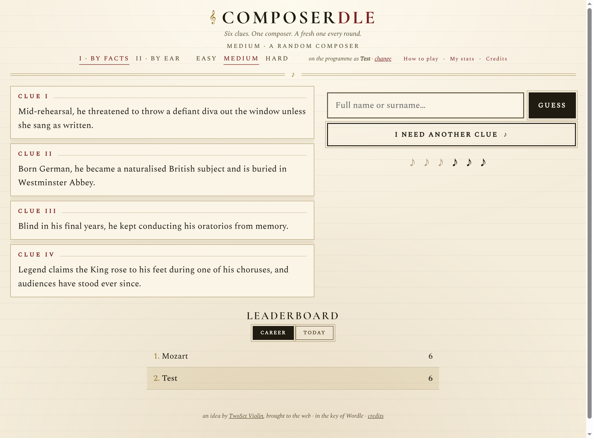
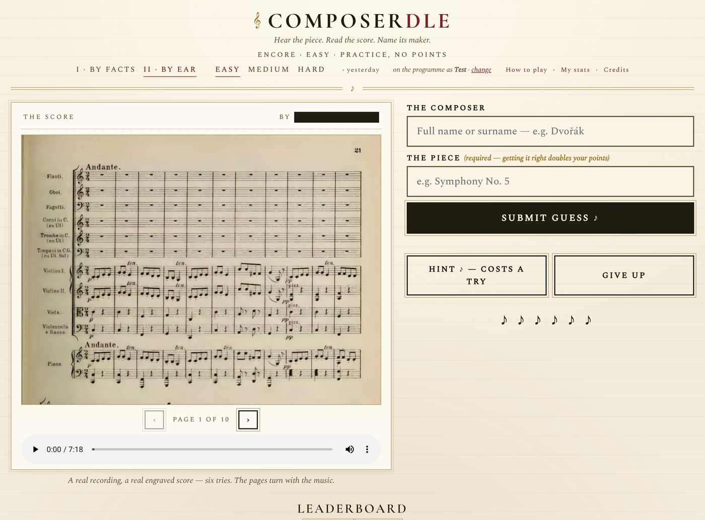
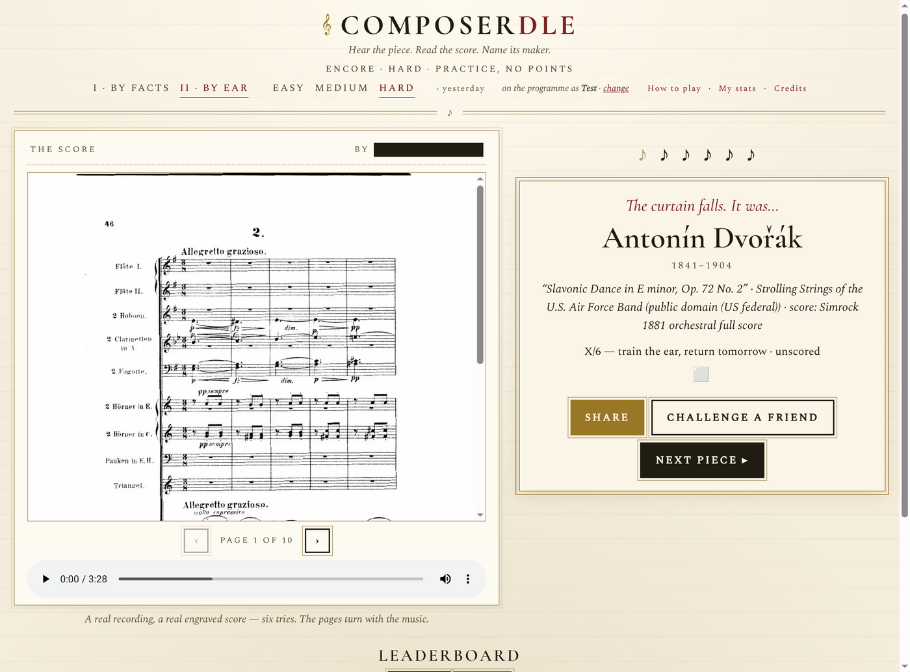

<div align="center">

# 🎼 Composerdle

### *Six clues. One dead genius. No pressure.*

**A daily guessing game for people who hear a piece and go "…wait, is that Brahms?"**

[**▶ Play it live**](https://composerdle-eta.vercel.app) &nbsp;·&nbsp; Wordle, but the answer went to the conservatory

</div>

---

Somewhere out there, a violinist screamed *"PRACTICE!"* into a webcam and, somewhere in the comments, an idea was born: what if Wordle, but you had to guess **composers**? That idea belongs to **[TwoSet Violin](https://www.youtube.com/@twosetviolin)**. This is a fan-made love-letter that drags their concept, kicking and powdered-wig askew, onto the web.

Composerdle plays two ways, both of them mildly humbling.

## 🎭 By Facts — *the one where trivia betrays you*

A mystery composer cowers behind six fun-fact clues that start cryptic and slowly lose their nerve. Guess early for bragging rights; stall for six and take the walk of shame anyway.

Pick your poison:
- **Easy** — clues your gran would get. *"He wrote the 'Nutcracker.'"*
- **Medium** — you'll need to have been paying attention.
- **Hard** — connoisseur mode. The famous-work giveaways **never** appear, so you're identifying Ravel from the fact that he refused to teach Gershwin. Good luck.

Every round is a fresh random composer with reshuffled clues, so it's gloriously endless.



## 🎧 By Ear — *the one where you stare at a redacted score and sweat*

Here's a **real public-domain recording** and the **real engraved score** — except the composer's name has been dramatically inked out like a censored government document. The pages even turn along with the music. Name the composer *and* the piece in six tries; nail the piece and your points **double**.

There are Easy / Medium / Hard tiers, a scored daily puzzle, streaks, a leaderboard for your friends to lord over you, and "challenge a friend" links for petty rivalries.



Get it right (or spectacularly wrong) and the curtain falls with the full reveal — who it was, what it was, who played it, and which dusty 19th-century edition the score came from:



## 🎻 Everything here is legitimately free

Every recording and score is public domain or Creative Commons — plundered lovingly from Wikimedia Commons, Musopen, the Internet Archive, BnF Gallica, and IMSLP. Some of the recordings are *magical*: Rachmaninoff playing his own Prelude in 1919, Gershwin at the piano on the 1924 *Rhapsody in Blue* disc, Holst conducting his own *Jupiter*. Full per-piece attribution lives on the in-game [**Credits**](https://composerdle-eta.vercel.app/credits.html) page.

## 🔧 How the sausage is made

- **Front end:** plain HTML/CSS/JS. No framework, no build step, no 400 MB of `node_modules` shipped to your browser. Distinctive engraved-concert-programme look (Cormorant Garamond + Spectral, on faux manuscript paper).
- **Back end:** Vercel serverless functions in `/api`. The answers, the facts, and the scoring all live server-side — you can dig through the page source all you like; the composer isn't in there.
- **State:** in-progress game state rides in an **HMAC-signed token** rather than a database, which (after a memorable bout with Vercel Blob's read-after-write staleness) means no race conditions and no way to forge your way onto the leaderboard.
- **Assets:** score pages and audio are self-hosted under opaque ids so the filenames don't spoil the answer.

```
api/          serverless endpoints + server-only game logic (_game, _pieces, _engine…)
index.html    By Facts
listen.html   By Ear
lb.js         shared client (leaderboard, stats, profile, sound effects)
tools/        asset localization pipeline
test.js       logic self-check  →  node test.js
```

The public-domain score images and audio are **not** committed (they're chunky, and the audio lives in Vercel Blob); `tools/localize-assets.js` regenerates them from their sources.

## 🙇 Credit where it's due
The **idea** is [TwoSet Violin](https://www.youtube.com/@twosetviolin)'s. The bugs are mine. 
*Now go practice. 🎻*
