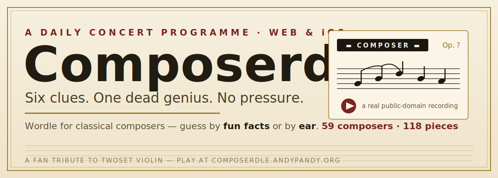

<p align="center">
  
</p>

<p align="center">
  <a href="https://composerdle.andypandy.org"><strong>Play Composerdle</strong></a>
  ·
  <a href="https://composerdle.andypandy.org/listen.html">Play by ear</a>
  ·
  <a href="https://composerdle.andypandy.org/credits.html">Recording and score credits</a>
</p>

Composerdle is a fan-made daily guessing game inspired by an idea from [TwoSet Violin](https://www.youtube.com/@twosetviolin). Identify a classical composer from progressively easier facts, or listen to a real public-domain recording and name both the composer and the piece.

## Two ways to play

| By facts | By ear |
| --- | --- |
| Six shuffled clues reveal a mystery composer. Easy, Medium, and Hard decide how generous the clues are. | A recording plays beside its engraved score—with the composer’s name redacted. Name the composer and work in six tries. |
| Endless random rounds | Scored daily puzzle, streaks, and leaderboard |

### By facts


### By ear


Correct guesses reveal the composer, work, performer, and score edition:


## What makes it work

- **59 composers and 118 works** across the current catalogue.
- **Real sources.** Recordings and scores are public domain or Creative Commons, with per-piece attribution on the [Credits page](https://composerdle.andypandy.org/credits.html).
- **No answer in the page source.** Game selection, clues, answers, and scoring stay in Vercel serverless functions.
- **Stateless rounds.** In-progress state travels in an HMAC-signed token instead of a database.
- **Opaque media assets.** Score pages and audio live on Cloudflare R2 without answer-spoiling filenames.
- **Native iOS client.** The SwiftUI app uses the same live API and catalogue as the web game.

## Architecture

```text
browser / SwiftUI app
        │
        ▼
Vercel API ── selects puzzle, validates guesses, signs game state
        │
        ├── Cloudflare R2: score pages + recordings
        └── profile + leaderboard data
```

```text
api/          Serverless endpoints and server-only game logic
index.html    By Facts web client
listen.html   By Ear web client
lb.js         Shared leaderboard, profile, stats, and sound UI
ios/          Native SwiftUI client generated with XcodeGen
tools/        Score/audio localization and R2 sync pipeline
test.js       Game-logic self-checks
```

The web client is plain HTML, CSS, and JavaScript—there is no front-end build step. The large score and audio files are deliberately not committed.

## Run the checks

```bash
npm install
node test.js
```

To build the native app, install [XcodeGen](https://github.com/yonaskolb/XcodeGen), then generate the Xcode project from `ios/project.yml`. The client targets iOS 17+ and talks to the live API.

## Credits

The original “Wordle for composers” idea is [TwoSet Violin](https://www.youtube.com/@twosetviolin)’s. Recordings and editions come from sources including Wikimedia Commons, Musopen, the Internet Archive, BnF Gallica, and IMSLP; see the in-game [Credits page](https://composerdle.andypandy.org/credits.html) for the exact attribution attached to every work.
